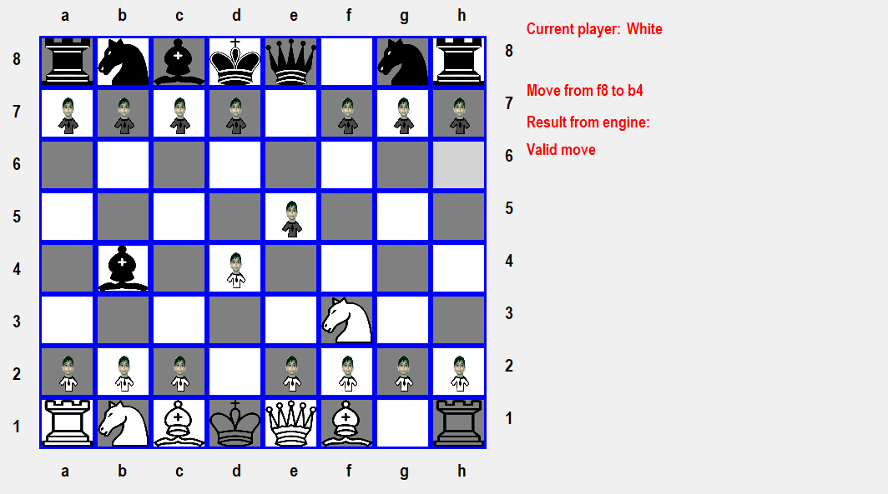

# Chess Game (Magshimim Project)

This project is an interactive chess game developed as part of the Magshimim program. It was collaboratively created by a duo, leveraging C# for the client-side interface and C++ for the server-side functionality. The game establishes a seamless connection between the client and server using pipes.

## Features
* Full implementation of chess rules and game mechanics: The game includes all standard chess rules and mechanics, allowing players to experience the authentic gameplay.
    Two-player mode for local multiplayer: Play against another player locally, taking turns on the same device. Enjoy the competitive spirit and strategic challenges of chess.
* Interactive GUI interface for easy gameplay: The graphical user interface (GUI) provides an intuitive and user-friendly environment for players to make moves and interact with the game. It enhances the overall gameplay experience.
* Error handling and validation for user moves: The game incorporates error handling and move validation mechanisms to ensure that players adhere to the rules of chess. It prevents invalid moves and provides feedback to guide players.
* Win condition detection and game over state: The game detects win conditions, such as checkmate or stalemate, and triggers the game over state accordingly. Players are notified of the outcome and can start a new game or exit.
* Young Dvir Profus as a pawn (A friend of ours)

## Screenshots

## Getting Started

To get started with the chess game project, follow these steps:

    Clone the repository:

    bash

    git clone <repository-url>

    Build the server-side code:
        Open the server-side project(chess-proj folder) in a C++ development environment (e.g., Visual Studio).
        Build the solution to compile the server code.

    Build the client-side code:
        Open the client-side project(chessGraphics) in a C# development environment (e.g., Visual Studio).
        Build the solution to compile the client code.

    Start the server:
        Run the compiled server application to start the server.
        The server will listen for incoming connections from clients.

    Start the client:
        Run the compiled client application to start the client.
        The client will establish a connection with the server.

    Play the game:
        Once the client is connected to the server, you can start playing the chess game.
        Follow the on-screen instructions and use the provided user interface to make moves.

## Dependencies

The project has the following dependencies:

    C# development environment (e.g., Visual Studio)
    C++ development environment (e.g., Visual Studio)
    Git (for cloning the repository)

Please ensure that you have the necessary development environments and tools installed before proceeding.

## License

The project is licensed under the [MIT License](LICENSE). Feel free to use, modify, and distribute the code as per the terms of the license.
Contact

## Contact Us
* Ofek Ifrah:
    * ofek080306@gmail.com
* Daniel Mordukhovich:
    * daniel.mordo06@gmail.com

We appreciate your interest in the chess game project!
